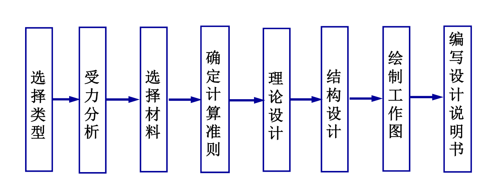

# 机械零件的设计

## 失效形式

- 失效

  在预期时间和规定条件下, 不能正常工作

- 形式

  - 整体断裂
  - 塑性变形
  - 腐蚀
  - 磨损
  - 胶合

    油膜破坏, 局部粘结, 然后随运动撕破

  - 接触疲劳

- [ ] 学完后, 哪些零件容易发生哪些失效

- 判据

  - 静强度

    静应力超过极限

  - 疲劳强度

    变应力

    失效的重要原因, 难以事先发觉

  - 摩擦

    - 腐蚀
    - 磨损
    - 打滑
    - 胶合
    - 接触疲劳

## 设计准则

- 静强度

  $$\sigma \leq [\sigma] = \frac {\sigma_{lim}} {S}$$

  $$\tau \leq [\tau] = \frac {\tau_{lim}} {S}$$

  lim 为塑性极限或强度极限, S 为适当的安全系数

- 疲劳强度

  $$\sigma \leq [\sigma] = \frac {\sigma_{lim}} {S_{\sigma}}$$

  $$\tau \leq [\tau] = \frac {\tau_{lim}} {S_{\tau}}$$

  疲劳强度的下的安全系数

  除此之外, 还需要考虑载荷变化规律的影响, 一般采用修正系数

- 摩擦

  - 不过度磨损

    $$p \leq [p]$$

  - 防止胶合破坏

    $$pv \leq [pv]$$

    单位接触面上摩擦功不太大

  - 验算速度

    $$v \leq [v]$$

- 其他

  - 刚度

    抵抗弹性变形

    考虑: 挠度, 偏转角, 扭转角

    $$
    y \leq [y]\\
    \theta \leq [\theta]\\
    \varphi \leq [\varphi]
    $$

  - 可靠性

    概率, 衡量零件的特征量

## 基本要求

- 强度

  - [ ] 提高方法

- 刚度

  - [ ] 提高方法

- 寿命

  - [ ] 主要因素

- 可靠性

  - [ ] 主要因素

- 结构工艺性

- 经济性

## 设计过程

### 材料选用原则

- 使用要求

  受拉伸 -> 钢材

  受压缩 -> 铸铁

  受冲击 -> 韧性好

  受静应力 -> 屈服极限好

  变应力 -> 疲劳强度高

  接触强度 -> 选可以表面强化处理的材料

  滑动摩擦 -> 减摩性

  腐蚀介质 -> 耐腐蚀

- 工艺要求

  外形复杂, 尺寸大 -> 可铸造的

  需要焊接 -> 材料焊接性好

  尺寸小, 简单, 大量, 适合冲压, 模锻 -> 塑性好的

- 经济

  铸铁成本低

### 常用材料

- [ ] 常识好了, 嘻嘻
