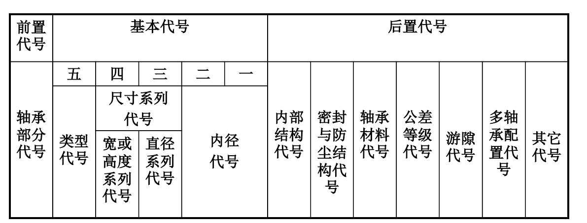

# 标准零件的类型和选用

## 抽象标准零件

- 作用

  函数的作用

- 分类与作用方式

  如同多态

- 参数

  如同函数的参数

- 标准标记

  如同函数名

## 螺纹和螺纹连接

### 作用

连接和传动

### 分类

- 内外之分

  组成螺旋副

- 连接螺纹和传动螺纹

- 牙型

  - 三角螺纹(普通螺纹)

    牙型角 60°

  - 管螺纹

    牙型角 55°

  - 梯形螺纹

    牙型角 30°

    用于传动

  - 锯齿形螺纹

    牙型角 33°

    3° 承载, 30° 增加牙根强度

  - 矩形螺纹

    传动效率高

  > 角度小, 传动效率高, 角度大, 强度高

  除矩形螺纹, 均标准化

### 作用方式

- [ ] 都加图片好了

- 螺栓连接

  通孔 -> 不太厚的薄板

  - 普通螺栓连接(受拉)

    孔和螺杆有间隙

    - [ ] 图片

  - 铰制孔螺栓连接(受剪)

    孔和螺杆无间隙(基孔制过渡配合)

    - [ ] 图片

- 双头螺柱连接

  不能加工通孔 -> 太厚

  方便拆卸

- 螺钉连接

  不能加工通孔 -> 太厚

  不经常拆卸

- 紧定螺钉连接

  多用于轴类零件

> 确实生活里面很常见, 但是没有过多注意其中的细节, 以为螺丝都一样呢, 此刻才发现各有名字呀

### 参数

- 大径 d(D)

- 小径 d1(D1)

- 中径 d2(D2)

- 螺距 p

- 线数 n

- 导程 S

  $$S = np$$

- 升角$\psi$

- 牙型角$\alpha$

  - 牙侧角$\beta$

- 接触高度 h

  旋合后接触面径向高度

### 标准标记

- 三个精度等级

  - A

    高精度, 为配合, 防振

  - B

    受载大, 经常拆卸

  - C

    一般, 常见

- 标记举例

  `[螺柱|螺母|螺栓] [A|B (C不用标记)] M [公称直径] X [螺距|(粗牙不标记)] X [长度]`

  - 垫圈 16 GB/T 93-1987

    公称直径 16mm

## 键与花键

### 作用

轴与回转零件的轴向固定 -> 传递转矩

### 分类与作用方式

- 连接类型

  - 平键连接
  - 半圆键连接
  - 楔键连接
  - 切向键连接

- [ ] 键的连接图片

- 平键

  - 普通平键
  - 薄型平键
  - 导向平键
  - 滑键

### 参数

- 键宽 b
- 键高 h
- 长度 L

  一般 L = (1.5~2)d (孔轴直径)

### 标准标记

- 类型

  圆头(A) 不用特地标记

  方头(B)

  半圆头(C)

- 标记举例

  `键 [(A不用标记)|B|C] [键宽] X [键高] X [长度]`

  - [ ] 花键标记 -> 真的烦耶 :fish:

## 销

### 作用

固定相互位置或作为过载剪断元件

### 分类与作用方式

### 参数

### 标准标记

- 标记举例

  `销 [直径] X [长度]`

## 带

### 作用

挠性拉拽元件的传动

### 分类与作用方式

- 传动类型

  摩擦型和啮合型

- V 带(摩擦型)

  两侧面为工作面

  能产生较大的摩檫力 -> 最主要优点

  - [ ] 优缺点

- 同步带

  多用于发动机多缸传动

### 参数

- 普通 V 带

  - 节面

    中性层

  - 顶宽 b
  - 节宽$b_p$

    中性层宽度

  - 宽度 h

  - 楔角

    40°

  - 每米质量 q

### 标准标记

- V 带

  `[带的类型] [带的宽度(不一定有)] [带的长度]`

## 链

### 作用

挠性拉拽元件的啮合传动

- 缺点

  不能保证恒定的传动比

### 分类与作用方式

- 滚子链

  尽量偶数链节数

- 齿形链

### 参数

- 结构

  - 滚子

    绕着套筒转动

    和链轮形成滚动摩擦, 减少磨损

  - 套筒

    与滚子滑动

    与内链板固连

  - 销轴

    与套筒滑动

    与外链板固连

- 连接方式

  - 开口销
  - 弹簧卡片
  - 过渡链节

- 节距 p

### 标准标记

`[链号]-[排数]-[链节数]`

## 滚动轴承

### 作用

支撑轴

### 分类与作用方式

- 常用滚动体

  - 球

  - 滚子

    - 滚针

    承载能力较强

- 球轴承和滚子轴承

- 接触角和受载方向

  - 向心轴承
  - 推力轴承

- 调心轴承和刚性轴承

### 参数

- 结构

  - 外圈
  - 滚动体
  - 保持架

    均匀隔开滚动体

  - 内圈

- 接触角$\alpha$

  - 向心轴承

    - 径向接触($\alpha = 0^\circ$)

      深沟球轴承, 除了径向, 也能较小轴向

    - 向心角接触轴承

      $$0^\circ < \alpha < 45^\circ$$

      角接触球轴承, 圆锥滚子轴承, 调心球轴承, 调心滚子轴承

  - 推力轴承

    - 轴向接触($\alpha = 90^\circ$)

      推力球轴承, 推力圆柱滚子轴承

    - 推力角接触轴承

      $$45^\circ < \alpha < 90^\circ$$

      推力球轴承, 推力圆锥滚子轴承, 推力调心滚子轴承

### 标准标记

- 调心球 1
- 调心滚子 2
- 圆锥滚子 3
- 推力球 5
- 深沟球 6
- 角接触球 7
- 推力圆柱滚子 8

- 命名结构

  

  - 尺寸系列

    适应承载能力的需要

  - 内径代号

    代号: 内径大小

    00 : 10

    01 : 12

    02 : 15

    03 : 17

    20~480 -> 代号 : 代号乘以 5

    22, 28, 32, 500 以上-> /代号 : 代号

  - 前置代号

    L : 套圈可分离

    K : 滚动体和保持架

  - 后置代号

    - 内部结构代号

      C : 15°

      AC : 25°

      B: 40°

    - 公差等级

      2, 4, 5, 6, 6X 和 0

      /P2, /P4, /P5, /P6, /P6X(仅圆锥滚子) 和 /P0(不用标出)

    - 游隙代号

      1, 2, 0(不用标出), 3, 4, 5

      /C1, /C2, /C3, /C4, /C5

  描述: 表示内径 XXmm, XX 尺寸系列的 XX 轴承, XX 级公差, [正常结构 | 接触角为], XX 组游隙

## 联轴器

### 作用

连接两轴

### 分类与作用方式

- 刚性联轴器

  - 凸缘联轴器

    - 铰制孔螺栓连接
    - 普通螺栓连接和对中榫

- 挠性联轴器

  - 十字滑块联轴器
  - 万向联轴器

    - [ ] 速度关系

    速度周期性变化, 引起附加载荷

    因此成对使用, 抵消附加载荷

  - 齿轮联轴器

    外壳用螺栓连接

- 安全联轴器

  剪切销安全联轴器

- 工作条件

  低速, 刚度大的短轴 -> 刚性联轴器

  低速, 刚度小的长轴 -> 挠性联轴器

  轴线相交 -> 万向联轴器

  径向位移大 -> 十字滑块或双万向

  转速高, 有冲击振动 -> 有弹性元件联轴器

### 参数

### 标准标记

- [ ] 好难

## 离合器

### 作用

传动过程随时分离和接合

- 与联轴器的区别

  离合器在运动过程的时候可分离

  联轴器需要运动停止, 然后拆卸

### 分类与作用方式

- 常用分类

  - 嵌入式

    - 牙嵌式

  - 摩擦式

### 参数

### 标准标记
