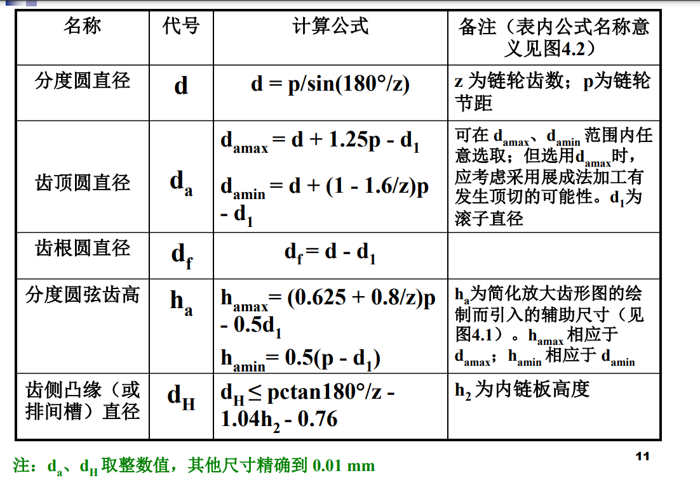

# 非标准零件的类型和选用

## 抽象非标准零件

- 作用

  设计目的

- 分类

- 参数

- 设计步骤

## V 带轮

### 作用

### 分类

- 根据基准直径 D

  2.5~3 d(配合的轴直径) : 实心式

  $\leq 300mm$ 腹板式或孔板式

  $\geq 300mm$ 轮辐式

### 参数

- 组成

  轮缘, 轮毂, 轮辐或辐板

- 基准直径

  已经标准化为尺寸系列

### 设计步骤

一般为减速装置

- 小带轮

  限制最小基准直径 -> 疲劳强度

- 大带轮

  根据小带轮和传动比 -> 向基准直径圆整

## 滚子链链轮

### 作用

### 分类

- 实心式 -> 小直径
- 孔板式 -> 中等直径
- 组合式 -> 大直径, 齿圈可更换

### 参数

### 设计步骤

## 齿轮

### 作用

- 优点

  传动比精确

- 确定

  若精度低, 振动和噪声大

  不宜用于轴间距离较大的传动

### 分类

- 齿轮结构

  - 实心式
  - 腹板式
  - 轮辐式

- 工作条件

  - 闭式

    能保证良好的润滑

  - 开式
  - 半开式

    大多浸入油池且装防护罩

- 硬度

  - 软齿面

    $$HBS \leq 350$$

  - 硬齿面

    $$HBS > 350$$

### 参数

- 齿数 z

  闭式软齿面 -> 模式减小, z 增大->重合度增大 -> 平稳,减噪 20~40

  闭式硬齿轮, 开式齿轮, 铸铁齿轮 -> 模数增大, z 减小 -> 避免断齿失效 -> 齿根抗弯曲疲劳 17~20

  大小齿轮互质 -> 齿面磨损均匀

- 齿宽系数$\phi_a$

  $$\phi_a = \frac {b} {a}$$

  - 齿宽 b

    承载能力

    过大, 齿宽方向受载不均匀

- 模数 m

- 螺旋角$\beta$

  增大螺旋角可以提高传动的平稳性和承载能力

  过大, 零件尺寸大, 传动效率降低

### 设计步骤

- 齿宽 b

  根据对象, 选取$\phi_a$

  大齿轮 $b_2 = a \phi_a$

  小齿轮 $b_1 = b_2 + (5 \sim 10)mm$

- 模数

  根据弯曲强度条件计算, 圆整为标准值

  尽量小一些好 -> 减小滑动系数, 切削量, 增大重合度

  传递动力 模数 $\leq$ 2 mm

  圆锥齿轮 模数 > 2 mm

- 中心距

  圆整

- 螺旋角

  $$\beta = arccos\frac {m_n (z_1 + z_2)} {2 a}$$

  高速 : 10~15°
  中间 : 8~12°
  低级 : 直齿轮
  人字形 : 20~30°

## 蜗杆与蜗轮

### 作用

- 优点

  实现大的传动比

  传动比, 噪声低, 具有自锁性

- 缺点

  相对滑动速度大 -> 摩擦发热大, 传动效率低

  不适合大功率, 长期连续工作

### 分类

- 结构:整体式与组合式

- 形状

  - 圆柱蜗杆传动

    - 普通圆柱蜗杆传动

      - 阿基米德蜗杆(ZA 蜗杆)

        低速, 轻载

      - 渐开线蜗杆(ZI 蜗杆)

        制造精度高

      - 法向直廓蜗杆(ZN 蜗杆)

        多头, 精密

      - 锥面包络(ZK 蜗杆)

        制造精度高

    - 圆弧圆柱蜗杆传动

      - 圆弧圆柱蜗杆传动(ZC)

  - 圆弧面蜗杆传动
  - 锥面蜗杆传动

### 参数

- 模数 m

- 压力角$\alpha$

  ZA, 轴向压力角 = 20°

  ZN, ZI, ZK 法向压力角 = 20°

- 蜗杆分度圆$d_1$(标准化了)

- 蜗杆直径系数 q

  $$q = \frac {d_1} {m}$$

- 传动比 i

  $$i \neq \frac {d_2} {d_1}$$

- 导程角$\gamma$

  $$tg \gamma = \frac { p _ { z } } { \pi d _ { 1 } } = \frac { z _ { 1 } p _ { x } } { \pi d _ { 1 } } = \frac { z _ { 1 } m } { d _ { 1 } } = \frac { z _ { 1 } } { q }$$

- 中心距

  $$a = \frac {1} {2} (d_1 + d_2) = \frac {m} {2} (q + z_2)$$

- 变位系数

  - [ ] 不知道耶

- 正确啮合

  模数与压力角相等

  当两轴线交错角为 90° 时, $\gamma$和$\beta$相等, 且方向相同

### 设计步骤

- 蜗杆头数和蜗轮齿数

  - [ ] 常识

## 滑动轴承

### 作用

- 特点

  转速高

### 分类

- 受载方向

  - 径向轴承
  - 径向止推轴承

    能同时承受径向和轴向的载荷

  - 止推轴承

- 油膜形成

  - 流体动压润滑轴承

  - 流体静力润滑轴承

    - [ ] 原理 :sob: :sob: :sob:

- 自润滑轴承

  又称干摩擦轴承

### 参数

- 组成结构

  - 轴瓦

    铜合金

  - 轴承衬

    轴承合金(巴氏合金)

### 设计步骤

## 轴

### 作用

支撑旋转零件

### 分类

- 受载分类

  - 转轴

    传递扭矩, 承受弯矩

    自行车脚踏处的轴

  - 传动轴

    只传递扭矩

    竖直摆放的轴传递扭矩

  - 心轴

    只承受弯矩

    自行车前后轮的轴都是心轴

### 参数

### 设计步骤

## 弹簧

- [ ] 等我有空看看 :sob: :sob: :sob:
