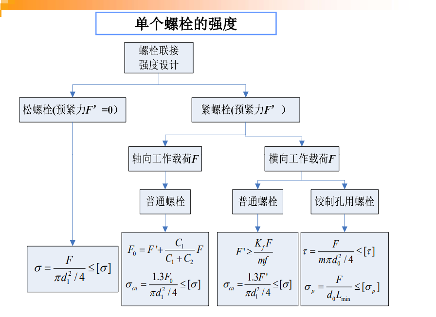
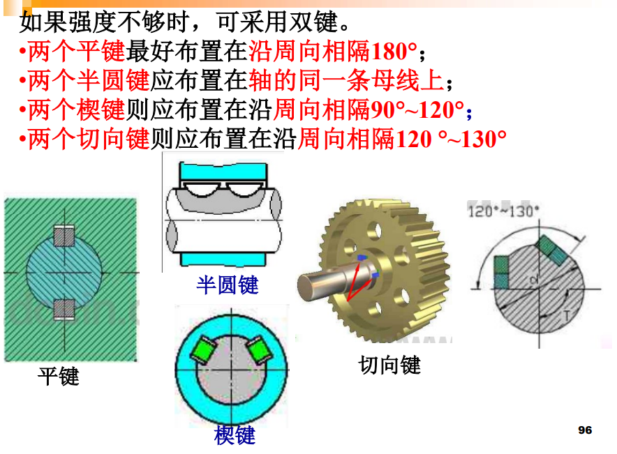

# 典型机械零件的静强度设计

- 选择类型
- 确定型号和尺寸

## 联轴器

### 选择

- 大功率, 重载

  齿轮联轴器

- 轴线相对位移

  挠性联轴器

  径向:十字滑块

  角位移: 万向联轴器

### 计算

$$T_{ca} = K_A T$$

$$n \leq n_{max}$$

## 离合器

### 选择

### 计算

- 能提供的转矩

  $$
  T_{max} = f Q R_m \\
  R_m = \frac{D_1 + D_2} {4}
  $$

  Q: 正压力

- 限制磨损和发热

  $$p = \frac {Q} {A} = \frac {4Q} {\pi (D_1^2 - D_2^2)} \leq [p]$$

- 修正系数

  $$p = [p_0]k_1 k_2 k_3$$

  $p_0$ 根据材料选择

  - [ ] 修正系数的具体含义:sob:

## 螺纹连接

### 基本概念

- 螺栓连接

  - 受拉螺栓连接

    塑性变形和断裂

    - 松螺栓连接(不受剪切)
    - 紧螺栓连接

      有预紧力

      横向与轴向载荷

  - 受剪螺栓连接

    剪断和压溃

### 计算

- 受拉螺栓

  - 松螺栓

    应力 -> 小径$d_1$ -> 找到合适的螺栓

  - 紧螺栓连接

    - 横向载荷

      用轴向的预紧力平衡横向载荷, 计算的任然是轴向的拉伸

      - 预紧力要求$F'$

        $$m f F' \geq K_f F$$

        m : 接合面数目

      - 强度计算

        第四强度理论 -> 复合应力转化为拉伸方向

        $$\sigma_{ca} = \sqrt {\sigma^2 + 3\tau^2} = \sqrt {\sigma^2 + 3(0.5\sigma)^2} = 1.3 \sigma$$

        只需要考虑 1.3 倍的横向拉伸应力 -> 小径$d_1$

        $$\sigma_{ca} = 1.3 \frac {F'} {A} \leq [\sigma]$$

        A 为圆(似乎是剪切)

    - 轴向载荷

      $$F_0 = F'' + F = F' + \frac {C_1}{C_1 + C_2}F$$

      $F''$:剩余预紧力, 应该大于 0
      $\frac {C_1}{C_1 + C_2}$: 相对刚度
      $C_1$: 螺栓刚度
      $C_2$: 连接件刚度

      得到小径$d_1$

      $$\sigma_{ca} = 1.3 \frac {F_0} {A} \leq [\sigma]$$

      A 为圆

- 受剪螺栓

  - 剪切

    $$\tau = \frac {F} {m A} \leq [\tau]$$

    $m$: 接合面数目

    $A$: 圆的面积$\frac {\pi d_0} {4}$

    当$d_0 < 30 mm$时, $d_0 = d_0 + 1$, 当$d_0 \geq 30 mm$时, $d_0 = d_0 + 2$

  - 挤压

    $$\sigma_p = \frac {F} {d_0 L_{min}} \leq [\sigma_p]$$

    $L_{min}$: 螺栓杆与孔壁挤压面的最小长度

### 其他

- 减载零件

  承担横向载荷

  减载销, 减载套筒, 减载键

  此时螺栓起保证连接作用, 不再受工作载荷

- 提高方式

  - 降低应力增量

    刚度

  - [ ] 减少集中应力的措施

### 单个螺栓

### 螺栓杆组

- 轴向载荷
- 横向载荷

多考虑螺栓个数 z 即可

- 转矩

  - 受拉普通螺栓

    $$f F ^ { \prime } r _ { 1 } + f F ^ { \prime  } r _ { 2 } + \cdots + f F ^ { \prime } r _ { z } \geq K _ { f } T$$

  - 受剪螺栓

    $$F _ { m a x } = \frac { T r_ { m a x } } { r _ { 1 } ^ { 2 } + r _ { 2 } ^ { 2 } \cdot \cdot + r _ { z } ^ { 2 } }$$

- 翻转力矩

  $$F _ { m a x } = \frac { M L _ { m a x } } { L _ { 1 } ^ { 2 } + L _ { 2 } ^ { 2 } \cdot \cdot + L _ { z } ^ { 2 } }$$

  接合面受力

  $$\sigma _ { p m a x } \approx \frac { z F ^ { \prime  } } { A } + \frac { M } { W } \leq [ \sigma _ { p } ]$$

  $$\sigma _ { p min } \approx \frac { z F ^ { \prime  } } { A } - \frac { M } { W } > 0$$

## 键连接

### 选择

- 应用

  一般用于相对静止场合

### 计算

- 主要失效

  工作面被压溃

  严重过载才会剪断, 更需要的是挤压应力

- 公式

  $$\sigma _ { p } = \frac {F} {A} = \frac {2T} {kld} = \frac {4T} {hld} \leq [ \sigma _ { p } ]$$

  k : 键和轮毂键槽的接触高度, 约为 0.5h

  $l$ : 圆头平键$l = L - b$, 平头$l = L$, 半圆头$l = L - \frac {b} {2}$

  两个键按照 1.5 个键计算

- 心中有数

  键长不宜超过 1.6~1.8d

### 增强方式

## 链传动

### 计算

- 工作拉力$F_e$

  $$F _ { e } = \frac { 1000 P } { v }$$

- 离心拉力$F_c$

  $$F _ { c } = q v ^ { 2 }$$

  $v < 4m/s$, 忽略不计

- 悬垂拉力$F_y$

  $$F _ { y } = K _ { y } q g a$$

- 紧边拉力

  $$F _ { 1 } = F _ { e } + F _ { c } + F _ { y }$$

- 松边拉力

  $$F _ { 2 } = F _ { c } + F _ { y }$$

- 压轴力

  $$F _ { Q } \approx K _ { A } ( F _ { 1 } + F _ { 2 } ) \approx 1.2 K _ { A } F _ { e }$$

- 静强度安全系数

  当链速 v<0.6m/s 时，传动的主要失效形式是链条受静力拉断

  $$S = \frac { Q n } { K _ { A } F _ { 1 } } \geq 4 \sim 8$$

  $Q$: 单排链极限拉伸载荷

  $n$: 链接数

## 滚动轴承

### 基本概念

- 基本额定静载荷$C_0$

  对工作在静载荷下不旋转的滚动轴承的界限

- 额定静载荷

  - 径向额定静载荷$C_{0r}$
  - 轴向额定静载荷$C_{0a}$

- 当量静载荷$P_0$

  对既承受径向载荷又承受轴向载荷的滚动轴承，则须将实际载荷换算

  $$P _ { 0 } = X _ { 0 } F _ { R } + Y _ { 0 } F _ { A }$$

  $F_R$:径向载荷

  $F_A$:轴向载荷

### 计算

- 校核

  $$\frac { C _ { 0 r } } { P _ { 0 r } } \geq S _ { 0 } 或 \frac { C _ { 0 a } } { P _ { 0 a } } \geq S _ { 0 }$$

## 轴

### 计算

- 弯扭组合

  $$M _ { c a } = \sqrt { M ^ { 2 } + ( \alpha T ) ^ { 2 } }$$

  不变的转矩 $\alpha \approx 0.3$

  转矩脉动变化时，$\alpha \approx 0.6$

  频繁正反转的轴，$\tau$可看为对称循环变应力，$\alpha = 1$

  若转矩的变化规律不清楚，一般也按脉动循环处理

- 校核

  $$S _ { S c a } = \frac { S _ { S _ { \sigma } } S _ { S_\tau } } { \sqrt { S _ { S_\sigma } ^ { 2 } + S _ { S _ { \tau } } } } \geq S _ { S }$$

## 弹簧
