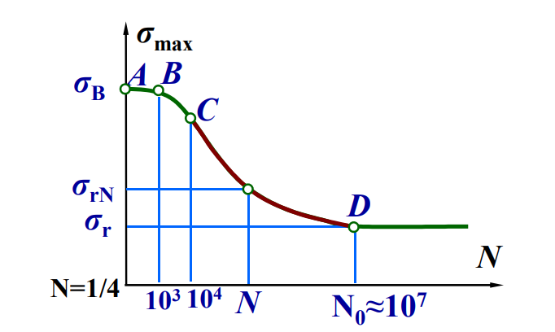
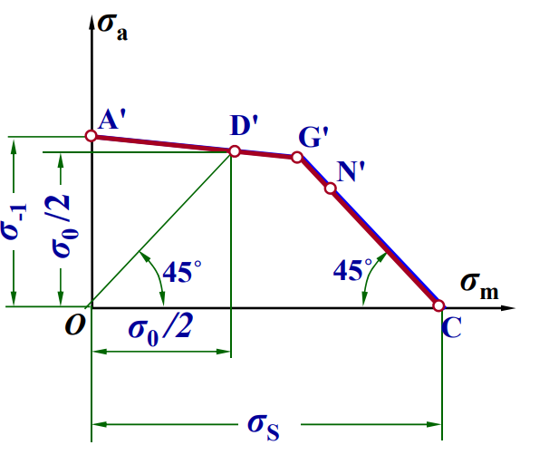
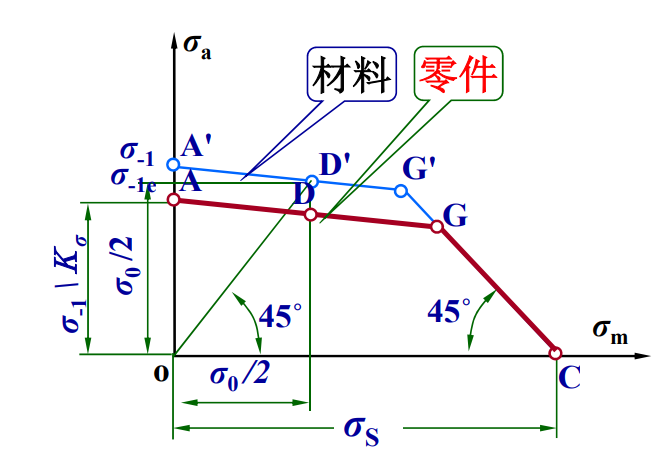
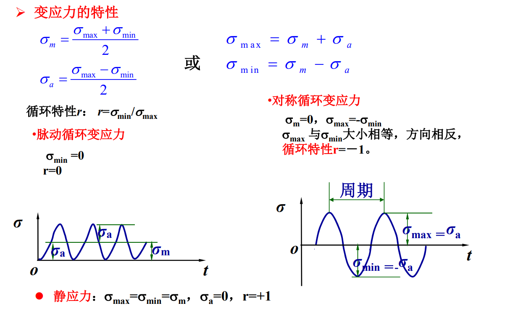
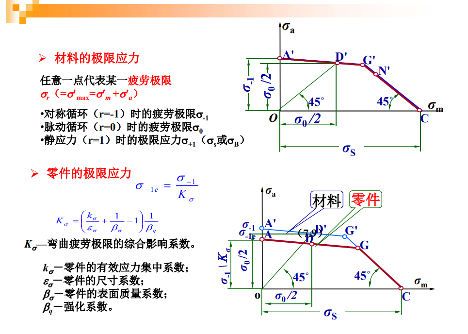

# 机械零件的疲劳强度

## 疲劳断裂

- 失效形式: 疲劳断裂
- 特征

  - 过程: 初始裂纹->扩展
  - 断裂面
    - 光滑面(疲劳发展区)
    - 粗糙去(脆性断裂区)
  - 无明显塑性变形的脆性突然断裂
  - 破坏时的应力（疲劳极限）远小于材料的屈服极限

## 基本概念

- 变载荷

  - 循环变载荷
  - 随机变载荷
  - 动载荷

    冲击载荷

- 变应力

  - 稳定循环变应力
    - 非对称循环变应力
    - 对称循环变应力
    - 脉动循环变应力
  - 不稳定循环变应力
  - 随机变应力

- 载荷谱

- $\sigma_a$
- $\sigma_m$
- $\sigma_{max}$
- $\sigma_{min}$
- $r$

  对称循环 $r = -1$

  脉动循环 $r = 0$

  静应力 $r = 1$

同一零件在相同寿命期限内，$\sigma_a$越大，r 值越小，越容易产生疲劳失效

- 疲劳极限$\sigma_{rN}$

  在某循环特性 r 时的变应力，经过 N 次循环后，材料不发生破坏的应力极限值

  一般是在材料试件上加上 r = -1 的对称循环变应力或 r = 0 的脉动循环变应力

## 极限应力图

- AB 段曲线: 静应力强度
- BC 段曲线: 低周疲劳
- CD 段曲线: 高周疲劳

  试件的有限寿命疲劳阶段

  大多数机械零件都工作在这一阶段

- D 点以后的线段$\sigma_{r\infty}$

  持久疲劳极限

- 有限疲劳极限$\sigma_{r N}$

  $$\sigma_{rN}  ^ { m }  \cdot N = 常数$$

  m 与材料有关

- 寿命系数$K_N$

  $$\sigma_{r N} ^ { m }  N = \sigma_{r } ^ { m } N_0$$

  $$\sigma_{r N} = \sigma_{r }  (\frac{N_0}{N})^{\frac {1} {m}} = \sigma_r K_N$$

  故

  $$K_N = (\frac {N_0}{N})^{\frac {1} {m}}$$

  若$N>N_0$, 则取$N = N_0$, 即 $K_N = 1$

- 整理理解

  观察纵轴:

  $0 \sim \sigma_r$, 此时不超过疲劳极限, 可以无限使用

  $\sigma_r \sim \sigma_B$, 此时超过疲劳极限, 则有一定的使用寿命, 区间的含义是, 超过疲劳极限 -> 静强度极限, 可见疲劳极限相比静强度极限很小

  可见, $\sigma_r$为疲劳极限, 应该有$\sigma_r = \sigma_{max}$

### 极限应力的推测

- 极限应力$\sigma_r$

  分解为极限平均应力和极限应力幅的叠加

  $$\sigma_r = \sigma_{max}' = \alpha \sigma_m' + \beta \sigma_a'$$

  考察特殊点

  

- 简化近似

  

  根据整理理解, $OA'G'C'$内, 小于极限应力, 则不会发生疲劳, 不会产生失效, 称为疲劳安全区

  在边界线上, 则表示处于将发生疲劳的临界状态

### 实际情况

- 综合影响系数$K_\sigma$或$K_\tau$

  $$K _ { \sigma } = \frac { \sigma_{- 1} } { \sigma _ { - 1 e } }$$

  下标$e$表示实际零件

在不对称循环时,对零件疲劳极限的影响主要是影响疲劳极限的应力幅部分

比例系数为$\frac {1} {K_\sigma}$ 或 $\frac {1} {K_\tau}$

- —弯曲疲劳极限的综合影响系数$K_\sigma$

  $$K _ { \sigma } = ( \frac { k _ { \sigma } } { \varepsilon _ { \sigma } } + \frac { 1 } { \beta _ { \sigma } } - 1 ) \frac { 1 } { \beta _ { q } }$$

  $k_{ \sigma }$: 零件的有效应力集中系数

  $\varepsilon_{ \sigma }$: 零件的尺寸系数

  $\beta_{ \sigma }$: 零件的表面质量系数

  $\beta_{ q }$: 强化系数

### 总结

## 影响机械零件疲劳强度的因素

一般来说，材料的静强度极限越高，其疲劳极限值也越高，疲劳强度也就越好

- 根据$K_{\sigma}$考虑

  - [ ] 困惑

## 稳定变应力下机械零件的疲劳强度计算

- [ ] 单向应力状态下的疲劳强度计算

## 规律性不稳定变应力下机械零件的疲劳强度计算

- 假说

  在每一次应力作用下，零件就会造成一定的疲劳损伤，当疲劳损伤累积到一定程度，便发生疲劳破坏

- 计算

  $$\sum _ { i = 1 } ^ { 3 } \frac { n _ { i } } { N _ { i } } = \frac { n _ { 1 } } { N _ { 1 } } + \frac { n _ { 2 } } { N _ { 2 } } + \frac { n _ { 3 } } { N _ { 3 } } = 1$$

  - 损伤率: $\frac { n _ { i } } { N _ { i } }$
  - 有效性: $\sigma > \sigma_r$, 才有损伤
  - 叠加行: 线性叠加损伤

- 变形

  $$\sigma _ { c a } = m \sqrt [m] { \frac { 1 } { N _ { 0 } } \sum _ { i = 1 } ^ { z } \sigma _ { i } ^ { m } n _ { i } }$$

- 安全系数

  $$\sigma _ { c a } \leq [ \sigma ] = \frac { \sigma _ { r } } { [ S ] }$$

- 注意

  若计算得到剩余疲劳循环次数$N>N_0$, 则意味着$\sigma < \sigma_r$, 应该注意这样的校正

## 机械零件的接触疲劳强度

- hertz 公式变形

  $p = \frac {F} {b}$: 表示单位接触线长度上的载荷

  $\rho$ 称为综合曲率半径

  $Z _ { E } = \sqrt { \frac { 1 } { \pi ( \frac { 1 - \mu _ { 1 } ^ { 2 } } { E _ { 1 } } + \frac { 1 - \mu _ { 2 } ^ { 2 } } { E _ { 2 } } ) } }$: 弹性影响系数

  简化为

  $$\sigma _ { H } = Z _ { E } \sqrt { \frac { p } { p } }$$

  接触处是变化的，故接触应力是变应力，其应力变化规律必为脉动循环
