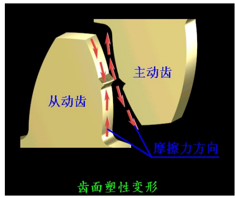
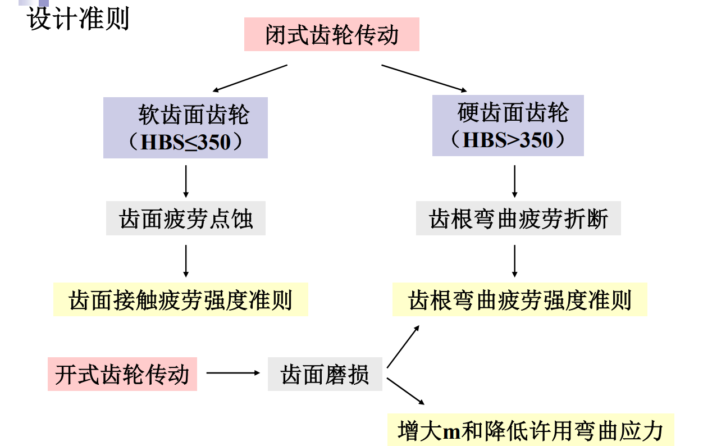

# 齿轮传动和蜗杆传动疲劳强度设计

## 齿轮传动疲劳强度设计

### 失效

- 因素

  与工作条件和齿面硬度有关

- 分类

  - 整体失效

    - 轮齿折断

  - 表面失效

    - 齿面接触疲劳
    - 胶合
    - 磨损
    - 齿面塑性变形

- 齿轮折断

  闭式硬齿轮

  - 原因

    齿根部位弯曲应力大

    齿根应力集中

  - 发生部位

    受拉一侧的齿根部位

  - 种类

    疲劳折断: 脉动

    过载折断: 冲击

  - 解决

- 接触疲劳(点蚀)

  闭式软齿轮

  - 原因:接触应力(脉动循环) ->微小裂缝(节线的齿根面)吸收油, 表面少油, 高压 -> 裂纹扩展

  是润混良好的闭式常见失效形式

  - 部位: 节线的齿根面

- 胶合(粘着磨损)

  - 高速重载, 润滑不良(热胶合)

    速度->瞬时高温

  - 缺乏润换, 低速重载(冷胶合)

- 齿面塑性变形

  低速重载齿轮

  - 主动轮->凹槽

    齿高部分受摩擦->拉伸

    齿底部分受扭矩->拉伸

  - 从动轮->凸脊

    齿高部分受摩擦->压缩

    齿底部分受阻力->压缩

  

- 磨粒磨损

  开式齿轮 -> 磨粒磨损比点蚀发展更快

- 总结

  - 闭式

    点蚀, 轮齿折断, 胶合

    计算-> 接触疲劳和齿根弯曲

  - 闭式

    轮齿弯曲和磨粒磨损

    计算 -> 弯曲疲劳

  

  闭式硬齿轮: 计算接触和弯曲, 然后综合比较

### 受力分析

- 假设

  齿宽中点处的集中力

  作用于节圆处

- 判定方法

  $F_t$: 主反从同

  $F_r$: 指向轮心

### 计算载荷

$$F_{ca} = K F_n$$

- 载荷系数

  $$K = K_A K_V K_\alpha K_\beta$$

  - $K_A$: 使用系数

  - $K_V$: 动载系数

  - $K_\alpha$: 齿间载荷分配系数

  - $K_\beta$: 齿向载荷分配系数

    接触疲劳: $K_\beta = K_{H \beta}$

    弯曲疲劳: $K_\beta = K_{F \beta}$

#### 接触疲劳

用来约束$d_1$

$$\sigma _ { H } = Z _ { H } Z _ { E } \sqrt { \frac { K F _ { t } } { b d _ { 1 } }  \cdot \frac { i \pm 1 } { i } }\leq [ \sigma _ { H } ]$$

$Z _ { H } = \sqrt { \frac { 2 } { \sin \alpha \cos \alpha } }$: $\alpha = 20^\circ$时, $Z _ { H } = 2.5$

用$\phi_d = \frac {b} {d_1}$和$F_t = \frac {2 T_1} {d_1}$ 带入

$$\sigma _ { H } = Z _ { H } Z _ { E } \sqrt { \frac { 2 K T_1 } { \phi_d d _ { 1 } ^3 }  \cdot \frac { i \pm 1 } { i } }\leq [ \sigma _ { H } ]$$

与齿轮的模式 m 无关

用来约束$d_1$

- 设计步骤

  给定$i$和$T_1$

  - 选定小齿轮齿数$z_1$

    $$z_2 = i z_1$$

  - 利用接触疲劳求$d_1$

    其他参数靠查

  - 计算模数$m$

    $$m = \frac { d_1 } { z_1 }$$

    圆整为标准值

  - 其他参数

    利用圆整后的$m$重新计算

    如$d_1 = m z_1$

  - 注意

    - 配对齿轮的工作接触应力相同, 但许用应力不同, 即注意用较小的许用应力

    - K 无法直接得到

      - 用估计值$K = K_t$

      - 根据校核公式得到$d_{1t}$

      - 利用$d_{1t}$计算$K$

      - 比较$K$和$K_t$

        若相差较大, 则调整$d_1$即可, 不需要迭代, 往后计算即可

        $$d _ { 1 } = d _ { 1 t } \sqrt [ 3 ] { \frac { K } { K _ { t } } }$$

#### 弯曲疲劳强度

用来约束$m$

$$\sigma _ { F } = \frac { K F _ { t } } { b m } Y _ { F \alpha } Y _ { S a } \leq [ \sigma _ { F } ]$$

- $Y_{ F \alpha }$: 齿形系数

  与模数 m 的大小无关

  当压力角 $\alpha$ 一定时, 只取决于齿数和变
  位系数

- $Y_{ S a }$: 应力校正系数

齿根弯曲疲劳强度取决于模数 m 和齿宽 b

用$\phi_d = \frac {b} {d_1}$和$F_t = \frac {2 T_1} {d_1}$ 以及$d_1 = m z_1$带入

$$\sigma _ { F } = \frac { 2 K T _ { 1 } Y _ { F \alpha } Y _ { s a } } { \phi _ { d } m ^ { 3 } z _ { 1 } ^ { 2 } } \leq [ \sigma _ { F } ]$$

齿数相同的齿轮, 模数 m 增大, 齿距 p 增大, 轮齿大, 抗弯能力强

- 设计

  - 选择齿数$z_1$

    $$z_2 = i z_1$$

  - 利用弯曲疲劳强度求$m$

    其他参数靠查

  - 模数圆整

  - 计算其他参数

  - 注意

    - K 一样使用估计

      $$m = m _ { t } \sqrt [ 3 ] { \frac { K } { K _ { t } } }$$

- [ ] 主要设计参数的合理选择

- 许用应力

  $$[ \sigma ] = K _ { N } \frac {\sigma _ { lim }}  {S}$$

  - 循环次数

    $$N = 60 n j L _ { h }$$

    j: 齿轮每转一圈单齿侧啮合次数

- 速度

  $$v = \frac {\pi d_{1t} n_1} {60 \times 1000}$$

  理解$v = \omega r = 2 \pi f r = \pi f d = \pi d n$

### 斜齿轮

#### 受力分析

- $F_t$: 主反从同

  $$F_t = F_n cos \alpha_n cos \beta$$

  $\alpha_n$: 法面压力角 20°

  $\beta$: 螺旋角

- $F_r$: 指向轮心

- $F_a$

  主动轮

  左右手

#### 计算

- [ ] 校核公式

- 基本公式

  $$d_1 = m z_1 cos \beta$$

### 锥齿轮

#### 受力分析

- $F_t$: 主反从同

- $F_r$: 指向轮心

- $F_a$: 小端指向大端

## 蜗杆传动疲劳强度设计

- 主要失效形式

  点蚀, 齿根折断, 齿面胶合, 过度磨损

  失效经常发生在蜗杆齿轮上面

#### 受力分析

- $F_t$: 主反从同

- $F_r$: 指向轮心

- $F_a$

  主动轮

  左右手

- [ ] 力的几何大小关系
