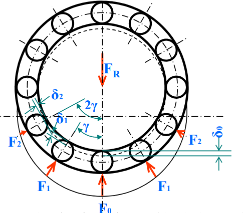
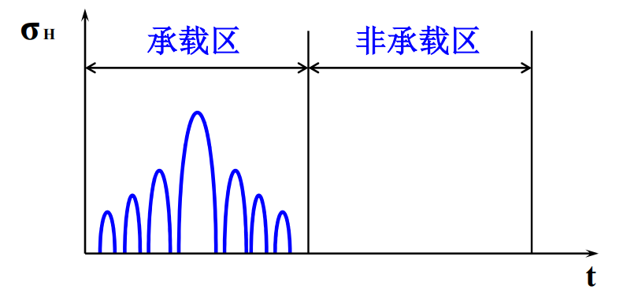
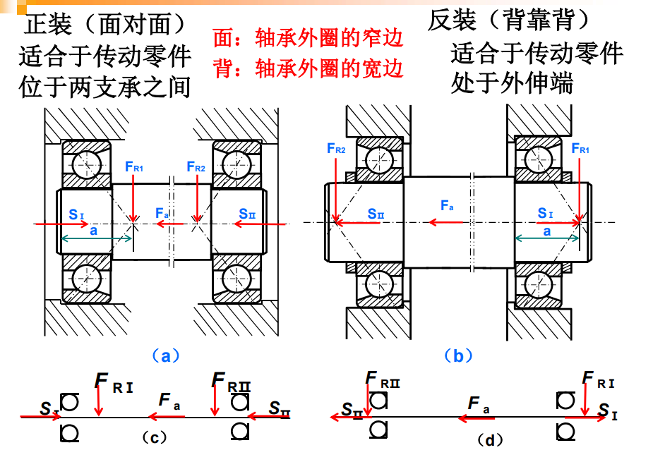
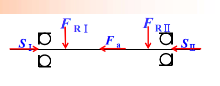

# 链-轴与滚动轴承疲劳强度设计

## 套筒滚子链

- 主要失效形式

  - 疲劳破坏

    链板、套筒或滚子会产生疲劳断裂或点蚀

  - 链条铰链的磨损

    销轴与套筒间承受较大的压力

    使链条伸长，增大动载荷、引起跳齿和加大噪声

  - 销轴与套筒的胶合

    润滑不良或速度过高

  - 链条的静载拉断

    低速（v < 6m/s）重载或瞬时严重过载时

- [ ] 额定功率曲线

### 计算

- 速度$v$

  $$v = \frac { z _ { 1 } n _ { 1 } p } { 60 \times 1000 } = \frac { z _ { 2 } n _ { 2 } p } { 60 \times 1000 }$$

  p: 链节距

  - 理解:$v=C \cdot n = z p n$

- 传动

  $$v_1 cos \beta = v  = v_2 cos \gamma$$

  $\beta \in [- \frac {180^\circ} {z_1}, \frac {180^\circ} {z_1}]$

  $\gamma \in [- \frac {180^\circ} {z_2}, \frac {180^\circ} {z_2}]$

  传递的链的速度相同

  $$i _ { 12 } = \frac { \omega _ { 1 } } { \omega _ { 2 } } = \frac { R _ { 2 } \cos \gamma } { R _ { 1 } \cos \beta }$$

  瞬时传动比

- 加速度

  $$a = \frac { d v } { d t } =\frac { d R_1 \omega cos \beta } { d t }= - R _ { 1 } \omega ^ { 2 } \sin \beta$$

  $\beta = \omega t$

- 多边形效应

  链速、从动轮角速度及瞬时传动比在周期性变化

  链轮转速越高, 节距越大(齿数越少) => 链传动的动载荷越大

  链的垂直方向分速度$v'$ 周期性变化会导致链传动的横向振动

  啮合瞬间所产生的相对速度会造成冲击和动载荷

### 设计过程

- 已知

  传递的功率、载荷性质、工作条件和链轮转速

- 设计

  链型号、链轮齿数，链节距、链条列数、中心距和润滑方式

- 设计步骤

  - 选择型号

    $$P _ { c a } = K _ { A } P = P _ { 0 } K _ { Z } K _ { L } K _ { P }$$

  - [ ] 计算过程

## 轴

- 假设

  集中力的作用点取为轮毂宽度的中点

  作用在轴上的扭矩，一般从传动件轮毂宽度的中点算起

### 计算

- 扭转强度

  估计直径

  $$\tau _ { T } = \frac { T } { W _ { T } } \times 10 ^ { 3 } \approx \frac { 9.55 P \times 10 ^ { 6 } } { 0.2 d ^ { 3 } n } \leq [ \tau ] _ { T }$$

  $$d \geq \sqrt [ 3 ] { \frac { 9.55 P \times 10 ^ { 6 } } { 0.2 [ \tau _ { T }] \cdot n }} = \sqrt [ 3 ] { \frac { 9.55 \times 10 ^ { 6 } } { 0.2 [ \tau ] } } \cdot \sqrt [ 3 ] { \frac { P } { n } }  = A \sqrt [ 3 ] { \frac { P } { n } }$$

  开一个键槽, 轴径应增大 3%; 开两个键槽, 轴径应增大 7%

  - 空心轴

    将$\sqrt [ 3 ] { \frac { P } { n } }$换成$\sqrt [ 3 ] { \frac { P } { n ( 1 - \beta ^ { 4 } ) } }$

    显然$\beta < 1$, 为内外径之比

- 弯扭组合强度计算

  $$M _ { c a } = \sqrt { M ^ { 2 } + ( \alpha T ) ^ { 2 } }$$

- 精确校核

  - [ ] 公式 :sob:

## 滚动轴承

- 载荷分布

  - 径向载荷分布

    

  - 承载区

  - 固定套圈

    每个点稳定脉动循环接触应力

  - 转动套圈

    

    呈周期性、不稳定变化

- 派生轴向力

  载荷角$\beta$大于接触角$\alpha$

  为了使派生轴向力 S 得到部分平衡此类滚动轴承通常都要求成对安装使用

  角接触球轴承, 圆锥滚子轴承

  深沟球轴承没有派生轴向力

- 失效形式

  - 点蚀

  - 烧伤

    润滑剂供应不足

  - 磨损
  - 卡死
  - 过度塑性变形

  主要失效形式是是疲劳点蚀

- 可靠性

  用可靠度 R 衡量

- 额定寿命

  其可靠度为 90% 时

- 基本额定动载荷 C

  寿命为$10^6$(可靠度 90%)

  C 增大 => 尺寸增大 => 承载能力增大

- 当量载荷 P

  假想载荷，与 C 同类型，它对轴承的作用与实际载荷的作用等效

  $$P = f_p (X F _ { R } + Y F _ { A })$$

  $f_p$: 载荷系数

  $$\operatorname { P^\varepsilon } L = 常数 = C^\varepsilon \times 10^6 (转) $$

  代入时间:

  $$L _ { h } = ( \frac {10 ^ { 6 }}  {60 n} ) ( \frac {f_tC} {P} ) ^ { \varepsilon } \quad h$$

  $f_t$: 温度系数

  $\varepsilon$, 球轴承 3, 滚子为 $\frac {10} {3}$

  滚在承载能力强

- 寿命修正系数$\alpha_1$

  $$L _ { h ( \alpha 1 ) } = \alpha _ { 1 } L _ { h }$$

### 角接触球轴承和圆锥滚子轴承

- 成对使用

  正装和反装

  

- 计算

  

  一定有的关系, 力平衡关系

  $$F _ { A I } = F _ { a } + F _ { A I I }$$

  - 判断正装还是反装

  - 判断谁被压紧

    与正装和反装有关

  - 计算派生轴向力

    通过径向轴向力计算

  - 放松的

    只受派生轴向力 S

  - 压紧的

    其他轴向力的代数和(除了自己的轴向力)

- [ ] 轴承的计算例题
- [ ] 轴承的装拆
