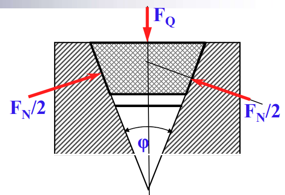

# 摩擦学设计方法

- [ ] 再细致看看好了

## 摩擦状态

- 干摩擦状态
- 边界润滑
- 混合润滑
- 薄膜润滑
- 弹流润滑
- 流体润滑

- 当量摩擦系数$f_v$

  

  $$F = f F _ { N } = f \frac { F _ { Q } } { \sin \phi / 2 }= f_v F_Q$$

## 润滑

- 形成动压油膜必要条件

  - 两摩擦表面必须有一定的相对滑动速度
  - 充分供应具有适当粘度的润滑油
  - 相对运动的两表面应当形成收敛的楔形间隙，即使润滑油由大口流入、小口流出
