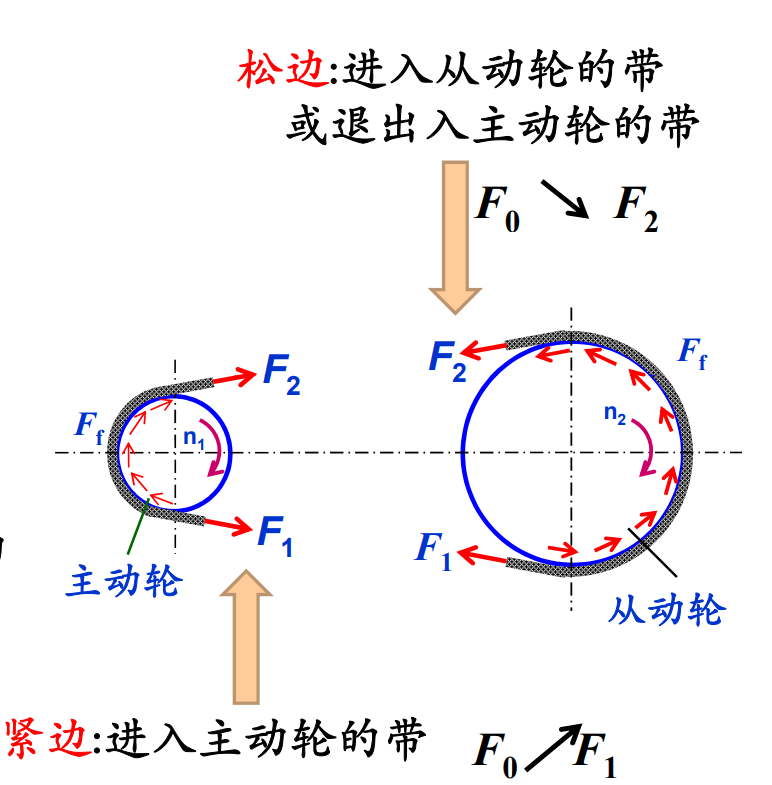

# 机械零件摩擦设计

- [ ] 之后再进一步看

## 带传动设计

刚开始有预紧力

- 紧边和松边

  

  假设总长不变, 根据形变量

  $$F_1 - F_0 = F_0 - F_2$$

  紧边拉力增量=松边拉力减少量

  变形

  $$F_1 + F_2 = 2F_0$$

- 欧拉公式

  $$F_1 = F_2 e^{f \alpha}$$

- 应用于高速级传动

- 最大有效拉力

  $$F_{ec} = 2F_0 \frac {e ^ {f \alpha} - 1} {e ^ {f \alpha} + 1 }$$

  - 记忆公式

    $$F_{ec} = F_f = F_1 - F_2 = 2F_0 \frac {F_1 - F_2} {F_1 + F_2} = 2F_0 \frac {e ^ {f \alpha} - 1} {e ^ {f \alpha} + 1 }$$

  - $F_0$: 预紧力, 正相关 => 过大, 发热, 磨损

  - $\alpha$: 包角 正相关 => 与 i 和 a 有关

    可以画两个圆的外公切线记忆

    i 增大, $\alpha$ 减小

    a 增大, $\alpha$ 增大

  - $f$: 摩擦系数 正相关

- 弹性打滑

### 设计

- 主要失效形式

  - 打滑
  - 疲劳破坏

## 螺纹连接设计

## 螺旋传动设计

## 弹性啮合与摩擦耦合传动简介
