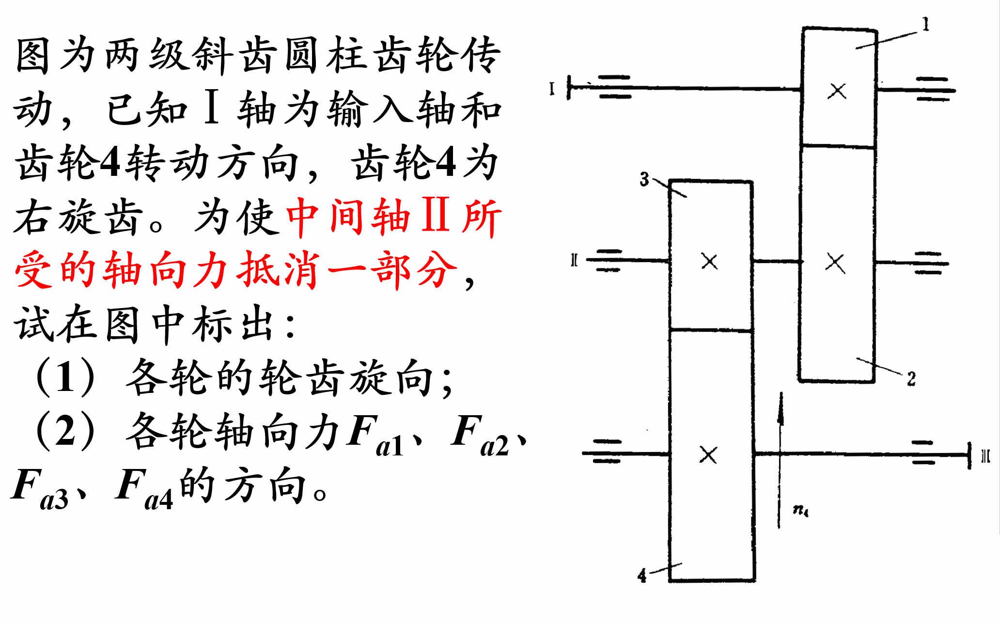
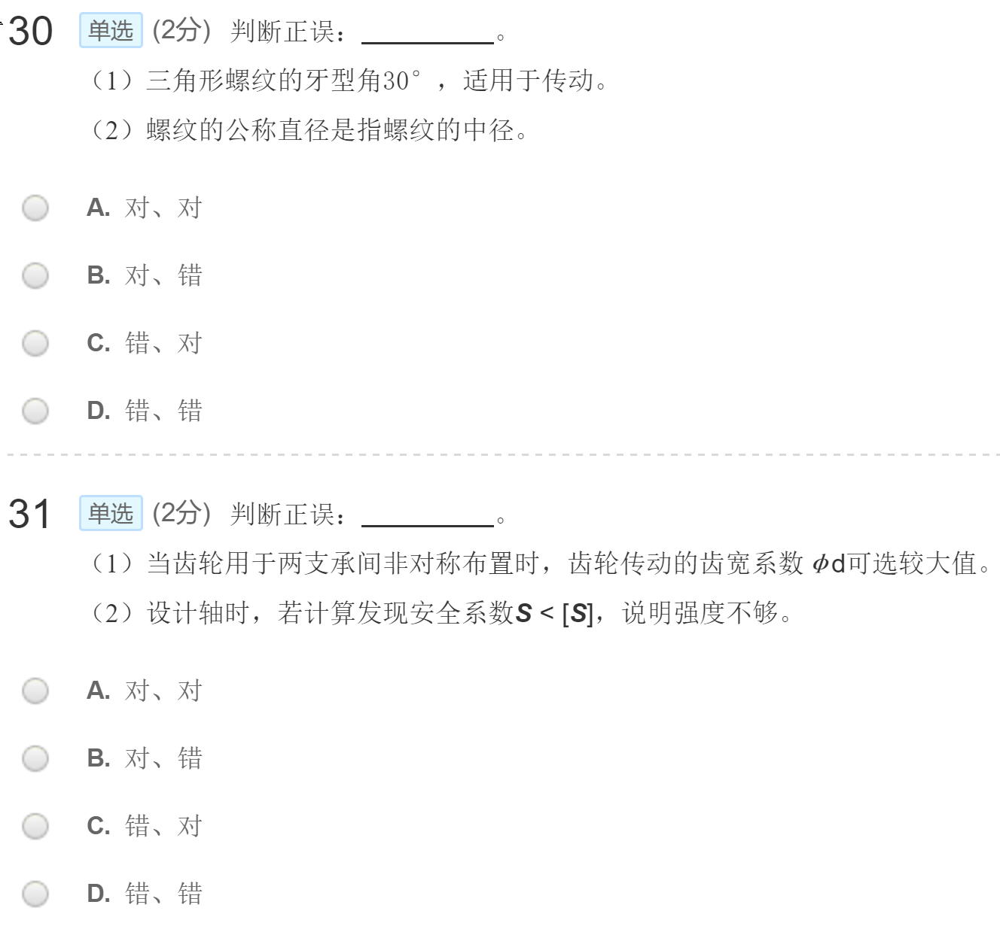
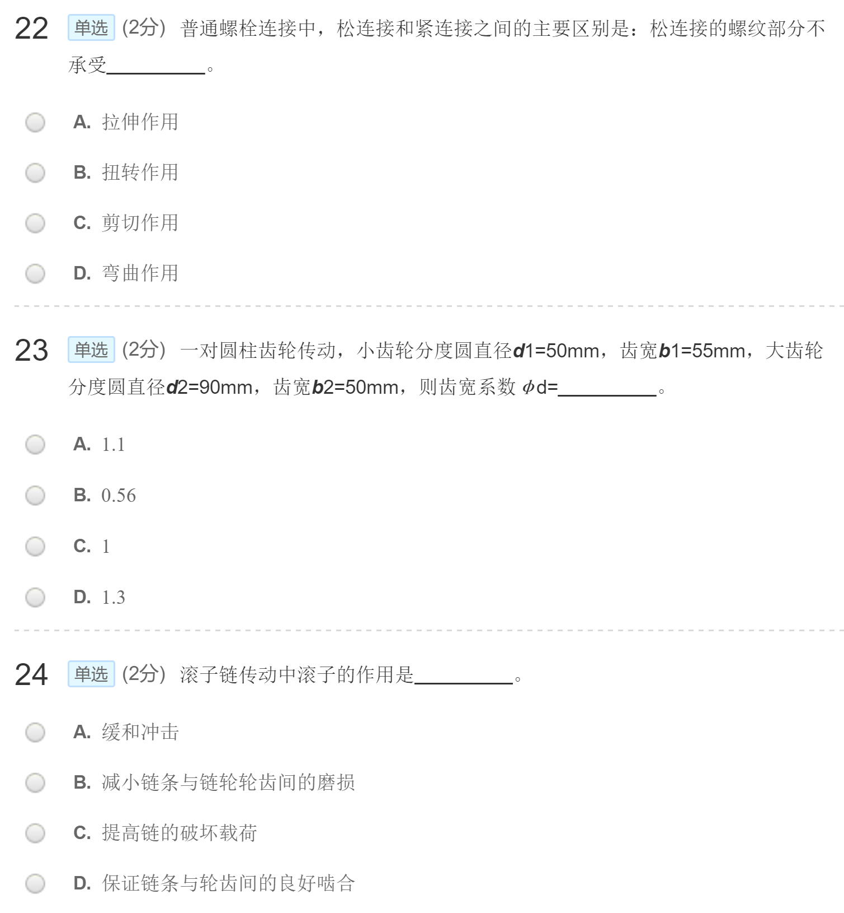

# 课堂作业

## 001

## 002

## 003

## 004

## 005

## 006

## 007

## 008

## 009

## 010

## 011

## 012

answers

1B;2B;3B;4C;5B;6C;7C;8A；9B

## 013

1. 打滑是 V 带传动正常工作时固有的特性。（ ）
   A 对 B 错
2. 对滚动轴承选用合适的密封方式，其目的是防止灰尘、水分等进入轴承，并阻止润滑剂的流失。（ ）
   A 对 B 错
3. 蜗杆传动的相对滑动速度较小时，其传动效率低且发热量大。（ ）
   A 对 B 错
4. 标记“SPB 2240 GB/T11544-2012”中窄 V 带传动的中心距是 2240mm. （ ）
   A 对 B 错
5. V 带传动工作时，在带的所有横截面上所产生的离心应力是相等的。（ ）
   A 对 B 错
6. 液体静压滑动轴承的承载油膜是靠摩擦面的相对运动而自动形成。（ ）
   A 对 B 错
7. 齿轮传动减速器的轴为转轴。（ ）
   A 对 B 错
8. 标记“键 181150 GB/T 1096-2003” 中，“11”表示普通平键的键宽。（ ）
   A 对 B 错

answers

1B;2A;3B;4B;5A;6B;7A;8B

## 014

1. 计算螺栓的小径至少应大于（ ）
   A 30.2mm B 34.5mm C 9.8mm D 11.02 mm

2. 单个螺栓所需要的预紧力为（ ）
   A 70 KN B 7 KN C 28KN D 280KN

3. 单个螺栓所受的横向载荷的最大值为（ B ）
   A 70 KN B 7 KN C 28KN D 280KN

4. 单个螺栓所受的应力情况是（ ）
   A 只受拉应力作用

B 只受扭转切应力作用

C 同时受拉应力和扭转切应力作用

D 不确定

answers

1B;2A;3B;4C

## 015

判断题（正确涂黑[A]，错误涂黑[B] ）

1. 齿轮传动中，主、从动轮齿面上产生塑性变形的方向是相同的。（ ）
2. 当螺纹公称直径、牙型角和螺纹线数均相同时，粗牙螺纹的自锁性能比细牙螺纹的自锁性能差。（ ）
3. 在传动系统中，带传动往往放在高速级是因为它可以传递较大的转矩。（ ）
4. 为提高蜗杆轴的刚度，应增大蜗杆的直径系数 q。 （ ）
5. 按接触强度校核式求得齿面接触应力 σH 是指齿面间各处接触应力的平均值。（ ）
6. 平键连接的一个优点是轴与轮毂的对中性较好。 （ ）
7. 滚动轴承内圈与轴颈的配合，通常采用基轴制。 （ ）
8. 旧自行车链条易脱落的主要原因是链条磨损后链节距增大，且大链轮齿数过多。 （ ）
9. 普通螺纹用于连接时，一般多用粗牙螺纹。 （ ）
10. 影响齿轮动载系数 Kv 大小的主要因素是圆周速度和安装刚度。 （ ）

answers

1B;2A;3B;4A;5B;6A;7B;8A；9A;10B

## 016

1.  两等宽的圆柱体接触，其直径 d1=2d2，弹性模量 E1=2E2，则接触应力为（ ） 。
    A. σH1=σH2 B. σH1=2σH2 C. σH1=4σH2 D. σH1=8σH2
2.  滚动轴承工作时，滚动体接触应力的应力循环特性是（ ） 。
    （A）r = -1 （B）r = 1 （C）r = 0 （D）0 < r< 1
3.  （ ）是开式齿轮传动最容易出现的失效形式。
    A. 齿面点蚀 B. 塑性变形 C. 胶合 D. 磨损
4.  紧螺栓连接强度计算时将螺栓所受的轴向拉力乘以 1.3，是由于（ ） 。
    A. 安全可靠 B. 保证足够的预紧力 C. 防止松脱 D. 计入扭转切应力
5.  平键连接能传递的最大扭矩为 T。现要传递的扭矩为 1.5T，则应（ ） 。
    A. 安装一对平键 B. 键宽 b 增大到 1.5 倍
    C. 健长 L 增大到 1.5 倍 D. 将键高 h 增加 1.5 倍
6.  V 带传动设计中，是根据（ ）选取 V 带型号的。
    A. 带的线速度 B. 带的有效应力 C.计算功率和小轮转速 D. 带传动中心距
7.  一普通螺栓的机械性能等级为 6.8，则该螺栓材料的屈服极限近似为（ ） Mpa。
    （A）600 （B）800 （C）680 （D）480
8.  链传动中，若以 p 表示链节距，则最适宜的中心距是（ ） 。
    A. （10~20）p B. （20~30）p C. （30~50）p D. （50~80）p
9.  在传递功率和速度相同的条件下，链传动压轴力要比带传动小，这主要是因为（ ） 。
    A. 链的质量大，离心力大 B. 啮合传动不需要很大的初拉力
    C. 在传递同样功率时，圆周力小 D. 这种传动只用来传递功率
10. 一对正确啮合的标准渐开线齿轮做减速传动时，若两轮的材料、热处理及齿面硬度均相同且寿命系数 KN1=KN2，则两轮的弯曲疲劳强度一般是（ ） 。
    A. 大齿轮较高 B. 小齿轮较高 C. 相同 D. 无法比较

answers

1A;2C;3D;4D;5A;6C;7D;8C；9B;10A

## 017

answers

11D;12D;13C;14D;15A;16A

## 018

17. 轴承 7214B 相应的内径、尺寸系列、接触角、公差等级和游隙组别是（ ） 。
    A. 内径 70mm，02 尺寸系列，接触角为 0，0 级公差，0 组游隙的角接触球轴承
    B. 内径 70mm，02 尺寸系列，接触角为 15，0 级公差，0 组游隙的角接触球轴承
    C. 内径 70mm，02 尺寸系列，接触角为 25，0 级公差，0 组游隙的角接触球轴承
    D. 内径 70mm，02 尺寸系列，接触角为 40，0 级公差，0 组游隙的角接触球轴承
18. 键 B161032 GB/T 1096-2003，该标记指的是（ ） 。
    A. 方头普通平键，键长 32 B. 半圆头普通平键，键高 10
    C. 圆头普通平键，键宽 10 D. 方头导向平键，键宽 10
19. 08A-1-88 GB/T1243-2006，对该标记描述不正确的是（ ） 。
    A. 链节数为 88 B. 齿形链 C. 链号为 08A D. 滚子链
20. 为连接承受横向工作载荷的两块薄钢板，一般采用（ ） 。
    A. 螺栓连接 B. 双头螺柱连接 C. 螺钉连接 D. 紧定螺钉连接
21. 标准直齿圆柱齿轮传动中，轮齿弯曲强度计算中的齿形系数 YFa 只取决于（ ） 。
    A. 模数 B. 齿数 C. 压力角 D. 齿宽系数
22. 绘制零件的极限应力线（σa—σm）图时，必须已知的数据是 （ ） 。
    A. σ-1，σ0，σs，kσ B. σ-1，σ0，σs，Κσ C. σ-1，σ0，φσ，kσ D. σ-1，σ0，φσ，Kσ

answers

17D;18A;19B;20A;21B;22B

## 019

answers

39D；40A；41A；42D；43A

## 020

answers

1C;2C;3A;4C;5A;6C ;7D;8C;9B

## 021

answers

28D;29A;30D;31C;32A;33B;34C

## 022

answers

10C;11B;12D;13D;14C;15A;16C ;17B;18C

## 023

answers

19B;20D;21C;22B;23C;24B ;25A;26D;27D

## 024

answers

44C;45C;46A;47B;48A;49C;50A

