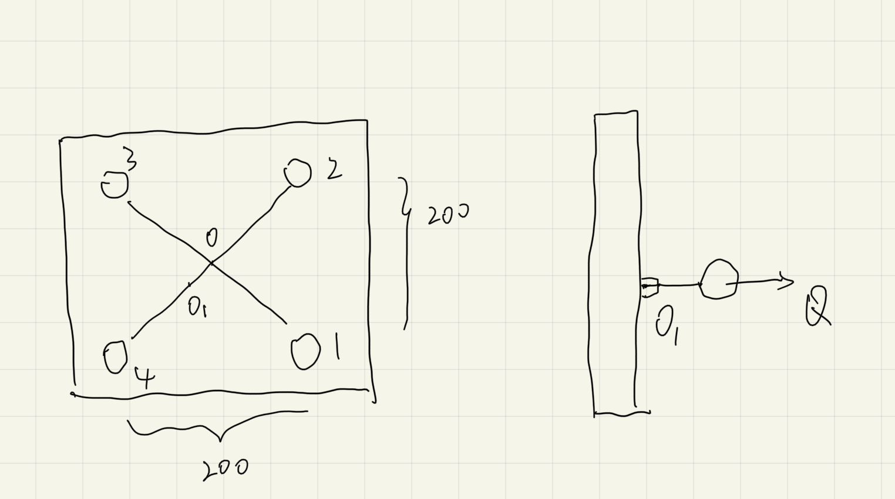

# 考试

## 关于计算

- 受力分析和旋向

  原题[019](test/coursework/README.md#019)

- 带的受力

  欧拉公式

- 角接触球轴承

- 螺栓

### 螺栓计算

题目类似 原题[002](test/coursework/README.md#002), 只是受力偏心

已知 $Q = 20000N$, 剩余预紧力与工作载荷的关系$F'' = 0.8 F$, $OO_1 = 5 \sqrt {2}$, $[\sigma] = 180$

1. 哪个螺栓受力最大
2. 受力最大的螺栓的工作载荷是多少
3. 螺栓的小径不小于多少

- 考试时的思考

  1. 考虑极限情况, $O_1$ 就在 4 上面, 显然 4 受到的工作载荷最大
  2. 假设知道
  3. 根据第二问的选项计算第三问, 发现 4 种情况只有一种有答案选项

  > 最后, 2 和 3 问都得到解答,:stuck_out_tongue_closed_eyes: :stuck_out_tongue_closed_eyes: :stuck_out_tongue_closed_eyes:

- 根据答案思考, 正式解答

  将力$Q$由$O_1$平移到$O$, 此时得到了一个拉力和一个绕 1-3 的弯矩

  考虑拉力, 由对称性, 被四个螺钉均分:

  $$F_p = \frac {Q} {4} = 5000$$

  考虑弯矩, 1 和 3 不提供弯矩, 故由 2 和 4 提供弯矩

  由 2 和 4 提供弯矩, 则有 2 和 4 受到的力大小相同, 方向相反, 形成力偶:

  $$F_p' \cdot L_{14} = Q \cdot OO_1 \Rightarrow F_p' = 500$$

  易知, 4 受拉, 2 受压, 故 4 受到的力(工作载荷)为二者力之和$F = 5500$

  故受到的总拉力为:

  $$F_0 = F + F'' = 1.8 F$$

  根据

  $$d_1 = \sqrt {\frac {1.3 F_0} {\pi \frac {[\sigma]} {4}} } = \sqrt {\frac {1.3 \times 1.8 F} {\pi \frac {[\sigma]} {4}} } = 9.54$$

  最终结果:

  2 -> 5500
  
  3 -> 9.54
